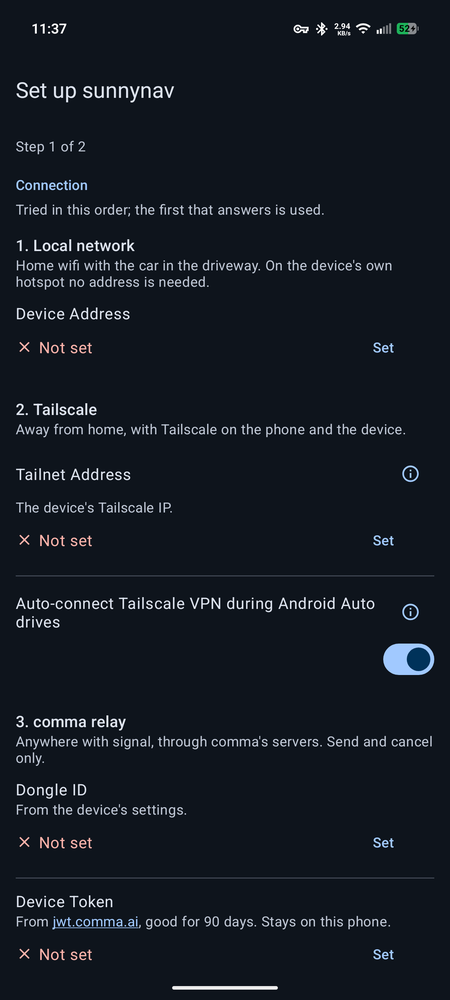
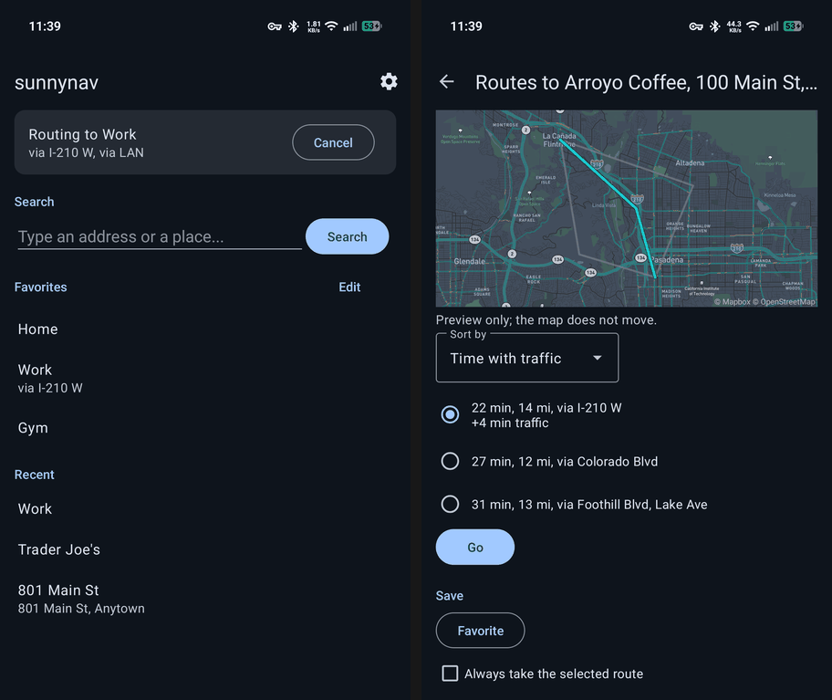
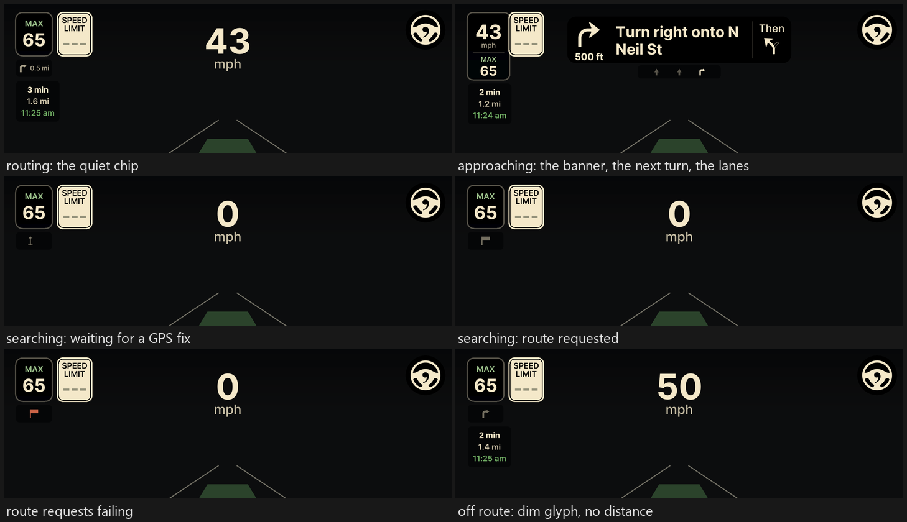
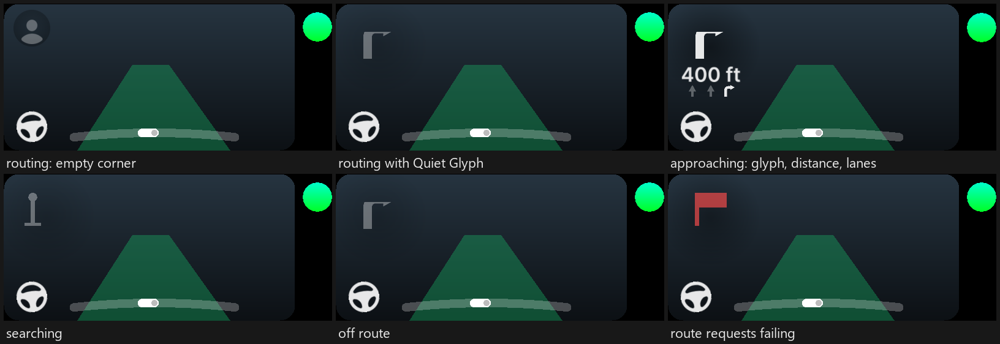
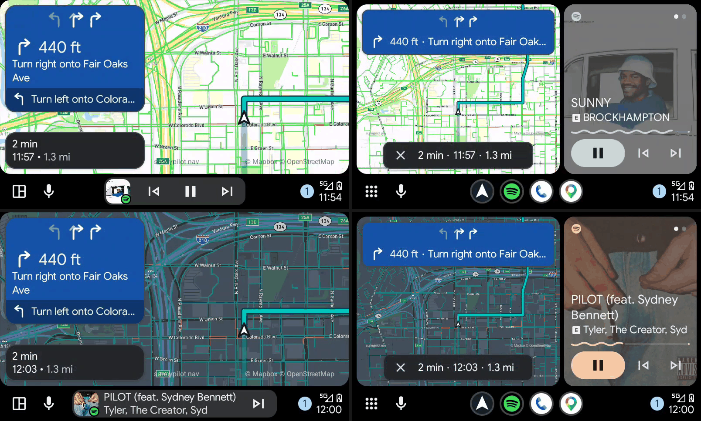
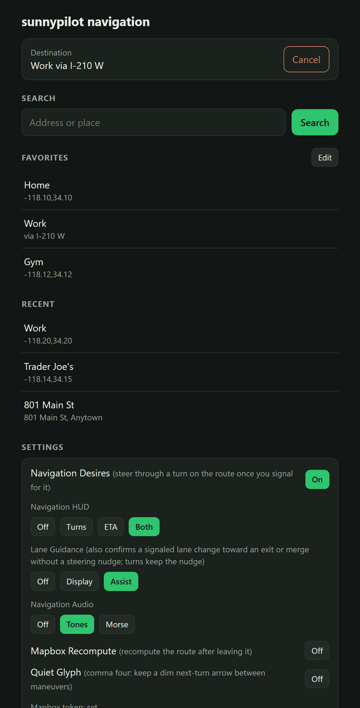

# Navigation

sunnypilot navigation on this branch is a driving aid: it shows and speaks turn-by-turn
guidance while you drive the car. It is not point-to-point autonomy. The route never
steers the car, changes lanes, or takes an exit on its own; every maneuver is yours to
make, with the same attention driving always demands.

This implementation builds on the navd work of **discountchubbs**, whose navigation
daemon is the foundation everything here extends.

## What it does

- Turn-by-turn guidance on the device's screen, transient: nothing between maneuvers,
  a chip, corner or banner as one approaches, and sounds if you want them.
- Destinations from your phone: search, a route pick with live traffic, favorites
  bound to the road you prefer, from home or from anywhere.
- An Android Auto app that mirrors the guidance on the head unit over the route line
  and a map.
- Optional steering suggestions, off by default and always driver-confirmed.

## Requirements

- A comma 3X or comma four running sunnypilot.
- A Mapbox account (free tier).
- For the app: an Android phone with Android Auto. For sending from anywhere: comma
  prime, so the device keeps its relay connection.

This page takes you from a stock sunnypilot install to your first route, in the order
you will do it. The pieces:

- the `nav` branch on the device, which routes, guides and serves a small phone page;
- two Mapbox tokens (or one), because Mapbox does the routing and the map;
- **sunnynav**, an Android Auto app for the phone, where destinations are searched,
  picked and sent, and which mirrors the guidance on the head unit;
- a way for the phone to reach the device, from the car's wifi to a Tailscale tailnet
  (for advanced users).

Only the first two are required. Without the app, the device's own page does the
setup and the sending from a phone on the car's network (see
[The device page](#the-device-page)).

## 1. Install the branch

Use sunnypilot's installer the way the community forum describes for any branch
(https://community.sunnypilot.ai/t/installing-sunnypilot-using-the-url-method/256):
on a fresh or just-uninstalled device, choose **Custom Software** and enter

```
install.sunnypilot.ai/fork/mpurnell1/nav
```

> [!WARNING]
> The `/fork/` part matters: `install.sunnypilot.ai/mpurnell1/nav` without it looks
> for a branch of that name in sunnypilot's own repository and fails.

The first boot builds, which takes a few minutes.

On a device already running sunnypilot, switching over SSH keeps `/data/params`, so
your car and toggle settings survive:

```
cd /data/openpilot
git remote add mpurnell https://github.com/mpurnell1/sunnypilot.git
./tools/op.sh switch mpurnell nav
sudo reboot
```

## 2. Mapbox tokens

Routing, search and the head unit's map come from Mapbox, billed per request to a
Mapbox account by its access token. A household's driving stays well inside the free
tier. Create an account at https://account.mapbox.com and read Mapbox's own two pages
before making tokens: the token guide (https://docs.mapbox.com/accounts/guides/tokens/)
and how to use Mapbox securely
(https://docs.mapbox.com/help/dive-deeper/how-to-use-mapbox-securely/). Their advice,
followed here: one token per application, each with the least scope it needs, never
the account's default token and never a secret (`sk.`) token anywhere.

Two applications ask Mapbox for things:

| Token | Lives on | Used for | Scopes |
|---|---|---|---|
| device | the comma device | routes, search, timezone lookup | none needed |
| phone | the sunnynav app | map tiles behind the route line; search and the route preview when the phone is away from the car | `styles:tiles` |

Make two public tokens at https://console.mapbox.com/account/access-tokens/: **Create
a token**, name it for where it will live, untick every scope for the device token and
leave only `styles:tiles` ticked for the phone token. If you would rather manage one
token, one public token with `styles:tiles` works in both places; the steps below
read the same either way.

Both are entered on the phone: the phone token in the app's first-run walk (step 3),
the device token in the app's Navigation section once the phone reaches the device
(step 5). Nothing is typed on the device's screen. The device token is stored on the
device and never sent to a browser; the phone token stays on the phone, and without it
the head unit still draws the route line, over dark ground, and search away from the
car is off.

If the route line is drawing with no map behind it, use **Test Connection** in the app
to verify it is set up.

## 3. The phone app

sunnynav is an Android Auto app on Google Play's internal testing track (it is not in
the public store). Ask mpurnell1 for a tester invite on the sunnypilot community forum
or by Discord DM, accept the opt-in link on the phone, and install it from the Play
Store page the link opens. Updates arrive through the Play Store like any other.

On first run the app walks two steps. Step one is the connection screen: the three
ways the phone can reach the device, tried in the order shown, the first that
answers is used. Set the ones you have (the next section says which you want) and tap
**Test Connection**. Step two is the phone's Mapbox token. Finish needs at least one
connection.



Everything on that walk can be changed later from Settings (the gear on the Navigate
screen).

## 4. Reaching the device

The phone reaches the device over whichever of three connections answers first.
Which ones you set up depends on how much you want away from home.

**Local network.** Any network the phone and device share: home wifi with the car in
the driveway, or the device's own hotspot. Everything works here: search, the route
pick, favorites, settings, and the head unit mirror. Enter the device's address on
your home network in **Device Address** (on the device, Settings → Network shows it
as IP Address).
On the device's hotspot no address is needed: sunnypilot's hotspot is always
192.168.43.1 and the app tries it by itself.

**comma relay.** Anywhere with signal, through comma's servers, for a device on comma
prime. Send and cancel only: comma asks forks to keep relay traffic at stock
openpilot's rate, so the guidance mirror and search never ride it. Enter the **Dongle
ID** (on the device, Settings → Device) and a **Device Token** from
https://jwt.comma.ai, a comma account token good for 90 days.

> [!WARNING]
> The comma token is full access to the device. It lives in the app's private storage
> and belongs nowhere else, never in a web page.

**Tailscale.** For advanced users who want the head unit mirror away from home with
wireless Android Auto, which takes the phone's wifi. See
[Advanced: Tailscale](#advanced-tailscale).

Pick by what you want from it:

1. App plus the Mapbox tokens: send and cancel from anywhere over the relay; search
   and the route pick from anywhere over the phone's own token; favorites, settings
   and the mirror on home wifi. Enough for most.
2. Wired Android Auto: join the phone to the device's hotspot once (on the device,
   Settings → Network → Tethering) and the mirror and the map come with it on every
   drive, no extra apps.
3. Wireless Android Auto with the mirror away from home: Tailscale on the phone and
   the device.

## 5. Turn navigation on

With the phone connected to the device, open Settings (the gear on the Navigate
screen). The **Navigation** section is the device's: turn on **Allow Navigation**,
set the **Mapbox Token** row to the device token, and turn on **Mapbox Recompute**
(off by default; without it a missed turn leaves you off the route until you find
your own way back). These rows write only while the car is parked; while it is
driving they dim with "Device is driving".

The same toggle is on the device for the car: a 3X has Settings → Navigation →
**Allow Navigation**, with the display and audio choices under it; a four has
**navigation** in its toggles beside the two steering choices (see
[Steering suggestions](#steering-suggestions)).

> [!NOTE]
> Navigation runs while the device is onroad. Offroad the status reads "Waiting for a
> drive", which is normal.

## 6. Your first route

With the car parked:

1. Open sunnynav on the phone. The Navigate screen shows the device's status at the
   top ("No route" once it is reached), then search, favorites and recents.
2. Type an address or a place and search. Pick a result.
3. The route pick shows the alternates Mapbox offers over a preview map, with time
   in traffic, typical time and distance; sort them as you like. Tap **Go**.
   **Favorite** saves the destination; **Always take the selected route** binds a
   favorite to the road you picked, so one tap on it later goes that way whenever
   Mapbox still offers it.
4. The device has the route. Drive: the chip, corner or head unit card wakes up as
   the first maneuver approaches.



Destinations can be set while driving too, over any of the three connections, but
the device's settings only change while it is parked (the rows dim with "Device is
driving").

Sending from the head unit: sunnynav appears in Android Auto's launcher. Its list
screen sends favorites and recents in one tap and searches (by voice while moving,
the head unit's rule); the guidance screen mirrors the device's next turn over the
route line and can cancel.

## What you will see and hear

The design is transient: nothing is on screen between maneuvers, and what appears is
the status. The same language holds on both devices and the head unit.

### On the comma 3X

- No route: nothing. Searching: the destination flag raises in stages, a bare pole
  until GPS has a fix, pole and banner while the route is requested, red if requests
  are failing.
- Routing: a quiet chip with the next turn's glyph and distance. As a maneuver
  approaches the chip expands into a banner with the instruction, the following turn
  and, when Mapbox knows them, the lanes that lead there. It collapses once the turn
  is made. Tap the chip to pin it open across maneuvers, tap again to let it
  breathe; press and hold to cancel the route.
- Off route: the glyph dims and the distance disappears rather than counting down to
  a turn you are not approaching. While rerouting, the searching flag returns until
  the new route lands.
- Arrival: a pill with remaining time, distance and arrival time (Navigation HUD:
  ETA or Both).



### On the comma four

The four's screen keeps itself out of the way, so navigation there is a corner, not a
card, in the slot the set-speed circle uses at the top left:

- Between maneuvers the corner is empty (the **Quiet Glyph** setting keeps a dim
  next-turn arrow there for those who want it). Audio carries the street names.
- As a maneuver approaches, the glyph, the distance and a small lane row fade in,
  and fade out once the turn is made. Alerts and the set-speed circle take the slot
  with priority. Tap the corner to pin it, tap again to release it.
- The same flags: searching in stages, red when requests fail, a dimmed glyph off
  route. Arrival is audio only. There is no hold-to-cancel on the four: cancel from
  the phone, the head unit or the device page.



### On the head unit

sunnynav's guidance screen is Android Auto's own navigation card over a map the app
draws itself: the device's route line, heading up around the car, on Mapbox tiles
paid for by the phone's token. The card shows the next maneuver, its distance and
the lanes, and the arrival estimate; "No route", "Off route" and "Not connected" are
spelled out. It updates within about a second of the device on a shared network.



### Sounds

**Navigation Audio** picks the style: Off, **Tones** (short pitch cues, rising for
right, falling for left, wider for sharper) or **Morse** (the maneuver keyed as a
code: R for a right turn, O3 for a roundabout's third exit). Cues sound in stages as
a maneuver approaches, at distances scaled to your speed, and never twice for the
same maneuver; a maneuver that needs no action gets no cue. On a 3X, Settings →
Navigation → **Sound Tour** plays every cue in your chosen style against the card it
will accompany, which is the way to learn them before a drive.

### Speed limits

While navigating, the route's speed limit fills in the speed limit sign when neither
the car nor map data knows one. Route data can be stale; posted signs win.

### Steering suggestions

Off by default and always driver-confirmed. **Navigation Desires** lets the driving
model take a route turn once you signal for it; **Lane Guidance** shows the lanes on
the turn card (Display) or additionally confirms a signaled lane change toward an
exit or merge without the steering nudge (Assist). Every lane change still starts
with your blinker, and nothing acts without a driver signal. Both live on the device
screen so that consent happens in the car; they also read and write from the phone
while parked.

## Settings, one name everywhere

A setting has the same name on the device screen, the device page and the phone app,
and a change made in one shows in the others:

| Setting | Options | What it does |
|---|---|---|
| Allow Navigation | on, off | The navigation service. Off, no destination can be set. |
| Navigation HUD | Off, Turns, ETA, Both | Off: no navigation HUD elements. Turns: next-turn card under the set speed. ETA: arrival pill tucked under the nav chip. Both: turn card and arrival pill. |
| Lane Guidance | Off, Display, Assist | Display: show which lanes lead to the next maneuver on the turn card. Assist: also confirm a signaled lane change toward an exit or merge immediately, without a steering nudge; lane changes before turns keep the nudge, and every lane change starts with the blinker. |
| Navigation Audio | Off, Tones, Morse | Tones: short pitch cues for each maneuver; rising means right, falling means left, wider means sharper. Morse: maneuver codes keyed in Morse, e.g. R for a right turn or O3 for a roundabout's third exit. |
| Navigation Desires | on, off | Steer through a turn on the route once you signal for it. |
| Mapbox Recompute | on, off | Recompute the route automatically after leaving it. Off by default. |
| Quiet Glyph | on, off | Keep a dim next-turn arrow in the corner between maneuvers. comma four only. |
| Mapbox Token | | The device's own public token, for its route requests and search. Write-only, set from the phone or the page. |

The phone app's own settings (the connections, the phone's Mapbox token,
Tailscale for Android Auto) are the phone's and appear nowhere else.

## The device page

The device serves a page at `http://<device-address>:5050` (on its hotspot,
`http://192.168.43.1:5050`) whenever it is on. It is the zero-install way to use
everything the phone app does on the car's network: search, the route pick with live
and typical times, favorites, recents, cancel, and the settings block, Allow
Navigation and the device token included. Any browser works and there is nothing to
install. It stays on the car's network by design: the page never rides comma's relay,
and the Mapbox token never reaches the browser.



## Away from the car: the relay contract

For scripts and apps of your own, the destination contract the app uses rides the
websocket the device keeps open to `athena.comma.ai` (comma prime). POST JSON-RPC to
`https://athena.comma.ai/<dongleId>` with `Authorization: JWT <token>`, the token from
https://jwt.comma.ai. That token is full access to the device: keep it in an app or a
script you run yourself, never in a web page.

Four additive methods sit next to the stock `setNavDestination`, which is untouched,
so comma connect keeps working:

- `getNavStatus()`: the page's status payload, including whether a set is allowed now.
- `listDestinations()`: favorites and recents, the page's shapes.
- `setDestination(dest, name, summary)`: set a destination, optionally with a chosen
  route summary, exactly like tapping a route on the page. Refused when navigation is
  disabled on the device.
- `cancelRoute()`: allowed any time, the passenger rule.

Refusals come back as JSON-RPC errors carrying the page's sentences. Guidance state
and search deliberately have no relay method: the relay is for rare, user-initiated
calls, and those two ride the device's HTTP API on the car's network. sunnypilot's
own sunnylink connection shares the method table where it is available.
`tools/send_nav_destination.py` is a one-file sender for a share link, coordinates or
an address.

## Expectations

- Routing needs internet on the device. If the connection drops mid-drive, guidance
  holds the route it has and cannot reroute until it returns.
- ETAs reflect traffic at the time the route was requested.
- Leaving the route triggers a reroute. A chosen alternate is kept while Mapbox still
  offers it and falls back to the fastest route when it does not.
- A route swap, from anyone, only ever changes suggestions, never control.
- Street names read lower case in the four's alerts: that is the four's house style.

## Advanced: Tailscale

Wireless Android Auto takes the phone's wifi, so away from home nothing local reaches
the device and the head unit mirror needs a network of its own. A Tailscale tailnet
gives the phone and the device a private address each, over any connection. Two
conditions: the device needs its own internet (comma prime's SIM or one of your own),
and you accept that a VPN is up on the phone while you drive. The app drives it, so
it is never on all day.

On the device, over SSH:

```
cd /data/openpilot
openpilot/sunnypilot/tools/tailscale_install.sh
```

The script downloads Tailscale's static build into `/data/tailscale`, where the
branch's process manager starts it on every boot (it survives sunnypilot and AGNOS
updates: nothing is written outside `/data`, and nothing runs as root), and prints
a login link. Open it, connect the device to your tailnet, and the script ends by
printing the device's 100.x address. On a 3X on home wifi the whole thing took
under half a minute plus the login click. If the page does not end on a connected
confirmation, running the script again prints a fresh link.

On the phone: install Tailscale from the Play Store, log in, connect once by hand so Android
holds the VPN permission, and in Tailscale's settings turn **Use Tailscale DNS
settings** off (the Android client's DNS breaks name resolution inside the tunnel as
of 1.102; the app uses the address, not the name). Then in sunnynav's connection
screen enter the device's **Tailnet Address** (100.x) and turn on **Auto-connect
Tailscale VPN during Android Auto drives**: the app connects the VPN when the head
unit session starts and drops it when it ends.

## Credits

- **discountchubbs**: the original navd port and daemon this work is built on.
- The sunnypilot team and contributors, whose UI and speed limit machinery this
  feature plugs into.
